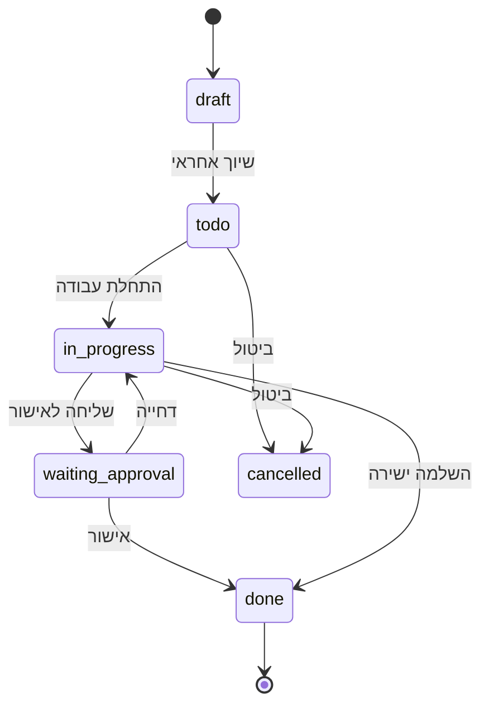

# Features Detailed - פירוט תכונות מלא

## 💰 מערכת תמחור משולשת

### תמחור לכל דירה
```typescript
interface UnitPricing {
  marketing_price: number;     // מחיר שיווקי - מוזן ידנית
  linear_price: number;        // מחיר למ"ר - מחושב אוטומטית
  price_20_80: number;         // מחיר במסלול 20/80 - מוזן ידנית או מחושב
}

// חישוב אוטומטי של מחיר לינארי
const calculateLinearPrice = (marketing_price: number, built_area: number) => {
  return marketing_price / built_area;
};
```

### תצוגת מחירים
- **לצופה רגיל**: רק מחיר שיווקי
- **לאיש מכירות**: שלושת המחירים
- **ליזם**: שלושת המחירים + תובנות השוואה

### אלגוריתם מחיר 20/80
```typescript
// נוסחה בסיסית לחישוב NPV
const calculatePrice2080 = (marketing_price: number, interestRate: number = 0.05) => {
  const payment20 = marketing_price * 0.2;
  const payment80 = marketing_price * 0.8;
  
  // הנחה שמסירה תהיה בעוד שנתיים
  const npv = payment20 + (payment80 / Math.pow(1 + interestRate, 2));
  return npv;
};
```

## 📋 מערכת משימות אוטומטית

### בנק משימות ברירת מחדל
```typescript
interface DefaultTaskBank {
  project_setup: {
    title: "פתיחת פרויקט";
    subtasks: [
      "העלאת קובץ תמהיל Excel",
      "שיוך דגמים לכל דירה",
      "בדיקת תקינות מפרט"
    ];
  };
  marketing_materials: {
    title: "בניית קובץ הדמיות";
    subtasks: [
      "תמונות חוץ",
      "הדמיות פנים דירות",
      "תמונות לובי ומתחמים"
    ];
  };
  sales_preparation: {
    title: "הכנה למכירה";
    subtasks: [
      "הכנת מצגת מכירה",
      "טופס רכישה",
      "שיוך אנשי מכירות לדירות"
    ];
  };
  documentation: {
    title: "מסמכים משפטיים";
    subtasks: [
      "גרמושקה מעודכנת",
      "חוזה מכירה טיפוסי",
      "אישורי בניה"
    ];
  };
}
```

### סוגי משימות ותגיות
```typescript
type TaskCategory = 
  | 'technical'      // טכניות
  | 'marketing'      // שיווקיות  
  | 'sales'          // מכירה
  | 'approvals'      // אישורים
  | 'administrative' // אדמיניסטרטיביות

interface Task {
  id: string;
  title: string;
  category: TaskCategory;
  priority: 'low' | 'medium' | 'high' | 'urgent';
  status: 'draft' | 'todo' | 'in_progress' | 'waiting_approval' | 'done' | 'cancelled';
  assigned_to: string;
  created_by: string;
  due_date?: Date;
  entity_type: 'project' | 'building' | 'floor' | 'unit';
  entity_id: string;
  parent_id?: string; // for subtasks
  attachments: string[];
  comments: Comment[];
}
```

### Workflow משימות


## 🏗️ מודלים תלת-ממדיים (V2)

### מבנה קבצים
```typescript
interface Model3D {
  id: string;
  name: string;
  file_path: string; // GLB format
  entity_type: 'project' | 'building' | 'unit';
  entity_id: string;
  hotspots: ModelHotspot[];
  created_at: Date;
}

interface ModelHotspot {
  id: string;
  position: [number, number, number]; // x, y, z coordinates
  title: string;
  description: string;
  action_type: 'info' | 'specification' | 'form' | 'document';
  action_data: any;
}
```

### אינטראקציות במודל
- **לחיצה על דירה**: פתיחת פרטי דירה
- **לחיצה על אזור**: הצגת מפרט (מטבח, שירותים וכו')
- **ניווט**: zoom, rotate, pan
- **מצמדים**: מעבר בין קומות/דירות

## 🔐 הרשאות מתקדמות

### מטריצת הרשאות
```typescript
interface PermissionMatrix {
  [role: string]: {
    developers: { read: boolean; write: boolean; delete: boolean };
    projects: { read: boolean; write: boolean; delete: boolean };
    units: { read: boolean; write: boolean; delete: boolean };
    tasks: { read: boolean; write: boolean; delete: boolean };
    documents: { read: boolean; write: boolean; delete: boolean };
    pricing: { read: boolean; write: boolean };
    analytics: { read: boolean };
  };
}

const permissions: PermissionMatrix = {
  system_admin: {
    developers: { read: true, write: true, delete: true },
    projects: { read: true, write: true, delete: true },
    units: { read: true, write: true, delete: true },
    tasks: { read: true, write: true, delete: true },
    documents: { read: true, write: true, delete: true },
    pricing: { read: true, write: true },
    analytics: { read: true }
  },
  developer: {
    developers: { read: false, write: false, delete: false },
    projects: { read: true, write: true, delete: false }, // only own projects
    units: { read: true, write: true, delete: false },
    tasks: { read: true, write: true, delete: false },
    documents: { read: true, write: true, delete: false },
    pricing: { read: true, write: true },
    analytics: { read: true }
  },
  sales_agent: {
    developers: { read: false, write: false, delete: false },
    projects: { read: true, write: false, delete: false }, // assigned projects only
    units: { read: true, write: true, delete: false }, // assigned units only
    tasks: { read: true, write: true, delete: false }, // assigned tasks only
    documents: { read: true, write: false, delete: false },
    pricing: { read: true, write: false },
    analytics: { read: false }
  },
  supplier: {
    developers: { read: false, write: false, delete: false },
    projects: { read: true, write: false, delete: false }, // assigned projects only
    units: { read: false, write: false, delete: false },
    tasks: { read: true, write: true, delete: false }, // assigned tasks only
    documents: { read: true, write: true, delete: false }, // assigned documents only
    pricing: { read: false, write: false },
    analytics: { read: false }
  }
};
```

### Cross-Developer Access
```typescript
interface UserAssignment {
  user_id: string;
  role: UserRole;
  developer_id?: string; // for developer employees
  assigned_project_ids: string[]; // for cross-developer access
  assigned_unit_ids: string[]; // for sales agents
  permissions_override?: Partial<Permission>; // special cases
}
```

## 🤖 AI ותובנות

### אלגוריתמי תובנות
```typescript
interface InsightEngine {
  priceAnalysis: (units: Unit[]) => PriceInsight[];
  salesPerformance: (salesAgents: User[], units: Unit[]) => PerformanceInsight[];
  taskBottlenecks: (tasks: Task[]) => BottleneckInsight[];
  documentGaps: (documents: Document[], entities: Entity[]) => GapInsight[];
}

interface PriceInsight {
  type: 'overpriced' | 'underpriced' | 'competitive';
  unit_ids: string[];
  suggested_price?: number;
  reason: string;
  confidence: number; // 0-1
}

interface PerformanceInsight {
  agent_id: string;
  avg_sale_time: number; // days
  conversion_rate: number; // 0-1
  recommended_actions: string[];
}
```

### דוחות אוטומטיים
```typescript
interface AutoReport {
  id: string;
  type: 'weekly_developer' | 'biweekly_marketing' | 'weekly_sales';
  recipient_role: UserRole;
  schedule: 'weekly' | 'biweekly' | 'monthly';
  format: 'pdf' | 'excel' | 'email';
  content_sections: ReportSection[];
}

interface ReportSection {
  title: string;
  type: 'chart' | 'table' | 'summary' | 'insights';
  data_source: string;
  filters?: any;
}
```

## 📊 דשבורד ניהולי (V2)

### ويدجטים עיקריים
```typescript
interface DashboardWidget {
  id: string;
  title: string;
  type: 'chart' | 'metric' | 'table' | 'map' | 'timeline';
  position: { x: number; y: number; width: number; height: number };
  data_source: string;
  refresh_interval: number; // seconds
  permissions: UserRole[];
}

// דוגמאות לויד'ג'טים
const defaultWidgets = [
  {
    title: "התפלגות סטטוס דירות",
    type: "chart",
    chart_type: "pie",
    data: "units_by_status"
  },
  {
    title: "משימות פתוחות לפי אחראי", 
    type: "chart",
    chart_type: "bar",
    data: "tasks_by_assignee"
  },
  {
    title: "מכירות החודש",
    type: "metric",
    data: "monthly_sales_count"
  },
  {
    title: "זמן ממוצע למכירה",
    type: "metric", 
    data: "avg_sale_time"
  }
];
```

## 🔄 Real-time Features

### עדכונים בזמן אמת
```typescript
interface RealtimeSubscription {
  channel: string;
  table: string;
  event: 'INSERT' | 'UPDATE' | 'DELETE';
  filter?: string;
  callback: (payload: any) => void;
}

// דוגמאות למנויים
const subscriptions = [
  {
    channel: 'units_updates',
    table: 'units',
    event: 'UPDATE',
    filter: 'status.neq.available',
    callback: updateUnitStatus
  },
  {
    channel: 'task_assignments', 
    table: 'tasks',
    event: 'INSERT',
    callback: notifyNewTask
  }
];
```

### התראות חכמות
```typescript
interface SmartNotification {
  id: string;
  type: 'task_overdue' | 'unit_stale' | 'document_missing' | 'price_alert';
  recipient_id: string;
  title: string;
  message: string;
  action_url?: string;
  priority: 'low' | 'medium' | 'high' | 'urgent';
  triggers: NotificationTrigger[];
}

interface NotificationTrigger {
  condition: string; // SQL-like condition
  check_interval: number; // minutes
  cooldown_period: number; // minutes between notifications
}
```

## 🎛️ ממשק אדמין

### ניהול מערכת
- יצירת יזמים ופרויקטים
- ניהול משתמשים והרשאות
- הגדרות מערכת גלובליות
- גיבויים ושחזורים
- לוגים ומעקב ביצועים

### ניתוח שימוש
- נתוני שימוש לפי משתמש
- ביצועי מערכת
- תדירות שימוש בתכונות
- זיהוי בעיות ואזורי שיפור 